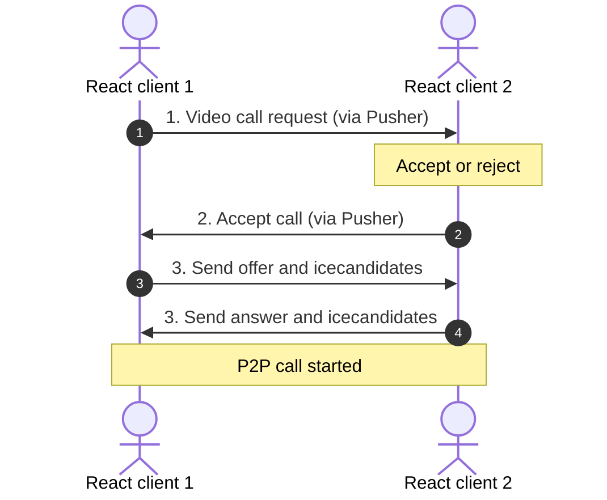

# Open chat (Backend - Laravel)

## Demo link
[](https://open-chat-frontend-alpha.vercel.app/app)

---

## Frontend repo link
[](https://github.com/progssp/open_chat_frontend)

---

## Overview
Open chat backend is a set of real-time backend APIs for a communication platform 'Open chat'(built in React) supporting instant messaging and video calling.


## Features
 - user authentication (passport)
 - real-time messaging api
 - Pusher websocket integration
 - WebRTC signalling (offer/answer/icecandidate)
 - Message persistence in MySql

---

## Tech stack
- PHP: v8.1+
- Laravel v13
- Composer
- MySql
- REST APIs
- Pusher

---

### WebRTC Signalling and Application Flow
<details>
This architecture flow chart illustrates how the backend leverages **Puhser** to coordinate network handshakes to let peers stream directly.



</details>

---

## Database & Cloud Infrastructure
 - **Application Hosting:** Scaled as a decoupled backend web service instance on **Render**.
 - **Managed Storage Layer:** Conneced directly via safe TLS connection pools to a cloud hosted **Aiven Cloud MySql** database.
 - **Signalling Infrastructure:** Uses persistent Websocket pipelines managed by **Pusher Channels** for global network communication.

---

## Core Engineering Features
 - **Signalling Routing Engine:** Acts as a network middleman translating Session Description Protocol(SDP) payloads and ICE candidates securely between isolates client browsers.
 - **Decoupled Muti-repo Setup:** Clean separation of concerns. The framework focus rests entirely on pure business logic execution and rapid data manipulation without visual rendering overhead.

---

## Installation

 - Clone the repository
```bash
git clone https://github.com/progssp/open_chat_backend.git
cd open_chat_backend
```
   
 - Install dependencies
```bash
composer install
```

 - Setup environment
```bash
cp .env.example .env
php artisan key:generate
```
   
 - Configure database
```bash
DB_CONNECTION=mysql
DB_HOST=127.0.0.1
DB_PORT=3306
DB_DATABASE=db_name
DB_USERNAME=db_user
DB_PASSWORD=db_password
```   

 - Configure Pusher and Broadcasting
```bash
BROADCAST_DRIVER=pusher
PUSHER_APP_ID=pusher_app_id
PUSHER_APP_KEY=pusher_app_key
PUSHER_APP_SECRET=pusher_app_secret
PUSHER_HOST=pusher_app_host
PUSHER_PORT=pusher_app_port
PUSHER_SCHEME=pusher_app_scheme
PUSHER_APP_CLUSTER=pusher_app_cluster
```

 - Setup Laravel Passport
```bash
php artisan migrate
php artisan passport:install
php artisan passport:client --personal --no-interaction
```

## Technical Setup
- The BroadcastServiceProvider must be uncommented in config/app.php to enable private channels.

## Usage
- Start local devlopment server
```bash
php artisan serve
```